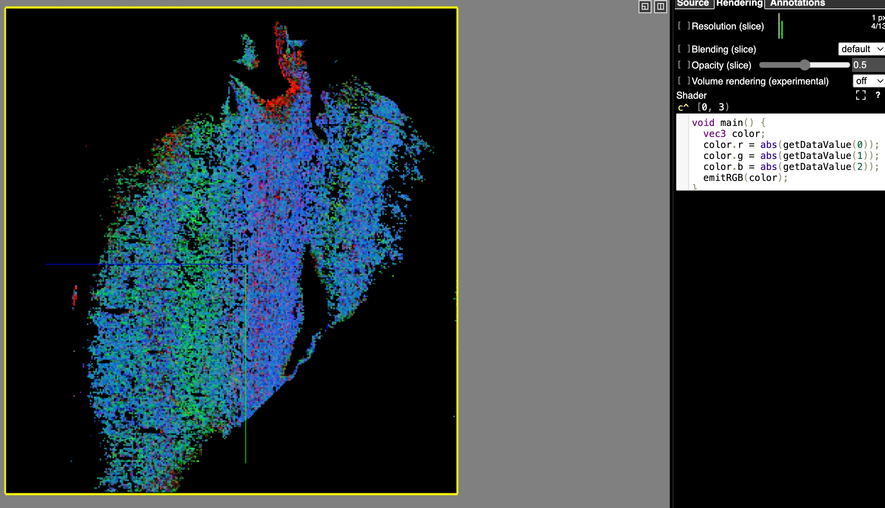

# Using Neuroglancer to Visualize Orientation Vector in Zarr Format

## 1. Ensure the vector dimension is in a single chunk

Neuroglancer requires that the dimension along the channels (where your vector data resides) must be within a single chunk. Specifically, the chunk size along the channel dimension must be **3**. 

## 2. Load the Zarr data into Neuroglancer

Once you have your data chunked correctly, you can load the Zarr dataset into Neuroglancer. Typically, you will:

## 2.1 Start Local Neuroglancer Server
1. Start Neuroglancer.
2. Open Neuroglancer in a browser.
3. Load Zarr if it presents locally  `load zarr:///example.path.zarr`

## 2.2 Start Neuroglancer on lincbrain
1. Find the dataset you want to visualize
2. Under `Open With` button, select Neuroglancer

## 3. Rename the channel dimension from `c'` to `c^`

Neuroglancer may label your dimension as `c'` or something else automatically.  

Renaming this dimension helps Neuroglancer interpret the data as a vector field (dimension of 3).  


## 4. Apply a custom shader for visualization

To actually see your vector data meaningfully rendered, you need a custom shader. Neuroglancer supports a small GLSL-like language for defining how each voxel is colored.

### 4.1 If the vectors already have unit norm

If you know that each voxel’s vector is already normalized (i.e., \(\|\mathbf{v}\| = 1\)), you can use the following simple shader to visualize the absolute value of each component (as RGB channels):

```glsl
void main() {
  vec3 color;
  color.r = abs(getDataValue(0));
  color.g = abs(getDataValue(1));
  color.b = abs(getDataValue(2));
  emitRGB(color);
}
```

### 4.2 If the vectors do not have unit norm

If your vectors do not have unit norm, and the magnitude of each vector encodes additional information (like reliability of the measurement), you can normalize the color in the shader and use the magnitude as alpha:

```glsl
void main() {
  vec4 color;
  color.r = abs(getDataValue(0));
  color.g = abs(getDataValue(1));
  color.b = abs(getDataValue(2));

  // Compute the norm (magnitude) of the vector
  color.a = sqrt(color.r * color.r + color.g * color.g + color.b * color.b);

  // Normalize the color by the magnitude
  color.r = color.r / color.a;
  color.g = color.g / color.a;
  color.b = color.b / color.a;

  // Scale alpha by some maximum norm if desired. If you have a known maximum,
  // replace MAX_NORM with that value; otherwise you can leave the alpha
  // as-is or adjust as needed.
  float MAX_NORM = 1.0; // modify this as appropriate
  color.a = color.a / MAX_NORM;

  emitRGBA(color);
}
```

In Neuroglancer, you can paste this shader code in the layer’s Shader Editor (usually found under the “Layer” panel).


## 5. Example

An example dataset can be found at [here](https://lincbrain.org/dandiset/000010/draft/files?location=sourcedata%2Fderivatives&page=2). The file `sample18_st_filtered.ome.zarr`. Once we change the dimension name to `c^` and apply the shader. We can see the result as following.
 

